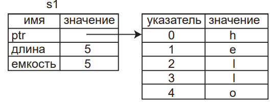

# Lesson 3 (Ownership concept)
**Ownership** is a unique feature of Rust, it allows this language to guarantee memory security without resorting to the garbage collector.
All data stored on the **stack** must have a known fixed size. But data, the size of which is unknown or may change at compile time, should be stored on the **heap**.

**Rules of ownership:**
 - Each value in the Rust language has a variable called its owner.
 - There can be only one owner at any given time.
 - If the owner moves out of the viewport, the value will be discarded.

**Example** of Variable and Viewport in which in can be used:
```rust
{ // s is not activated, it is not declared yet
 let s = "hello "; // s is activated starting this moment and then
 // do smth by using s
} // whis viewport finished and s is not activated
```
### Ways vatiables and data interact: moving
**Structure of String type:**

`prt` points to the heap.

```rust
let s1 = String::from("hello");
let s2 = s1;
```
This code corresponds to this picture (after reassignment if the string, we can't use variable `s1`, and this type of assignment is equivalent to std::move for C++). 

But this code will work because of size of such types as int, float during compilation already known, so they store at stack, so we can use both of variables `x` and `y` (as variables assigned in the stack but not in the heap we can use both of them). This means that there is no reason why variable `x` should not be valid after we create variable `y`.
```rust
    let x = 5;
    let y = x;
    println!("x = {}, y = {}", x, y);
```
### Ownership and functions
The semantics of passing a value to a function is similar to the semantics of assigning a value to a variable. Passing a variable to a function will cause it to be moved or copied, as well as assigning a value to a variable.
```rust
fn main() {
    let s = String::from("hello"); // s goes in of scope
    takes_ownership(s); // the value of s is moved to the function and therefore no longer valid here
    // println!("{}", s); // This code is forbidden as s was moved
    let x = 5; // x goes in of scope
    makes_copy(x); // x will move to the function, but i32 is copyable, so it's fine if x is used after that
    println!("{}", x); // This code is allowed because x is copyable
} // Here, x goes out of scope, followed by s

fn takes_ownership(some_string: String) { // some_string goes in of scope
    println!("{}", some_string);
} // some_string goes out of scope and calling `drop`

fn makes_copy(some_integer: i32) { // some_integer goes in of scope
    println!("{}", some_integer);
} // some_integer goes out of scope
```
### Returning by tuple
```rust
fn main() {
    let s1 = String::from("hello");
    let (s2, len) = calculate_length(s1);
    println!("Длина '{}' равна {}.", s2, len);
    println!("{}", s1); // we can't use s1, as it was moved
}
fn calculate_length(s: String) -> (String, usize) {
    let length = s.len(); // len() возвращает длину экземпляра типа String
    (s, length)
}
```
As we can't use s1 because it was moved, we can wewrite code above by using `references`. At this example we don't give our variable to ownership, we just pass reference.
```rust
fn main() {
    let s1 = String::from("hello");
    let (s2, len) = calculate_length(&s1);
    println!("Length '{}' equal {}.", s2, len);
    println!("String s1 = {}", s1); // now we can use both s1 and s2
}
fn calculate_length(s: &String) -> (&String, usize) {
    let length = s.len(); // len() возвращает длину экземпляра типа String
    (s, length)
}
```
Next example demonstrate that if we don't own by variable (bacause we use reference, we can't change it)
```rust
fn main() {
    let s = String::from("hello");
    change(&s);
}
fn change(some_string: &String) {
    // Here is we try to change variable that we don't own
    some_string.push_str(", world");
}
```
But we can use changable reference by passing to the function `&mut s`
```rust
fn main() {
    let mut s = String::from("hello");
    change(&mut s);
}
fn change(some_string: &mut String) {
    // Here is we try to change variable that we don't own
    some_string.push_str(", world");
}
```
But changable reference has an constrain, it can't be borrow more than once at a time. This code doesn't work
```rust
fn main() {
    let mut s = String::from("hello");
    let r1 = &mut s;
    let r2 = &mut s;
    println!("{}, {}", r1, r2);
}
```
### Dangling reference
**Dangling reference** - a pointer that refers to a place in memory that may have been given to someone else by freeing up some memory while maintaining a pointer to it.
In Rust we can't create dangling link, because compiler forbids this.
Example of dangling link:
```rust
fn main() {
    // Here we try to create a link to a variable that doesn't exist
    let reference_to_nothing = dangle();
}
fn dangle() -> &String {
    // Variable S exist in this block
    let s = String::from("hello");
    // Here we try tu return link to s
    &s
} // After the block variable s doesn't exist, so we can't use it 
```
As the result, we **have this rules**:
- At any given time, you can have one of two options, but not both: one changeable link or any number of immutable links.
- Links must always be valid
### Slice type
Slices allow you to refer not to the entire collection, but to a continuous sequence of elements in the collection.
```rust
fn first_word(s: &String) -> usize
{
    let bytes = s.as_bytes();
    for(i, &item) in bytes.iter().enumerate(){
        if item == b' '{
            return i;
        }
    }
    s.len()
}
```
At this code we search fist word by using first entry of space symbol. First of all, we convert string to bytes by using `.as_bytes()` method. Then we create iterator by using method `.iter()`. Method `.enumerate()` return tuple (`index`, `link to the element`).
### String slice
A **string slice** is a reference to a part of a String type value. It looks like this:
```rust
let s = String::from("hello world");
let hello = &s[0..5];
let world = &s[6..11];
```

Also `arrays` also are **slices**:
```rust
let a = [1, 2, 3, 4, 5];
let slice = &a[1..3];
```